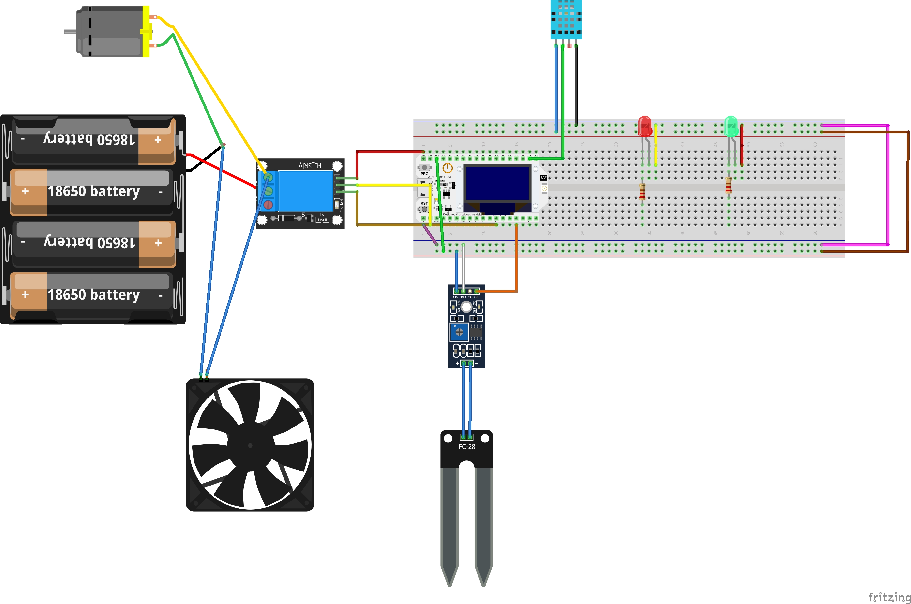

🌱 Sistema de Riego Automático con ESP32, DHT11, FC-28 y Control Web

Este proyecto implementa un sistema de riego automático utilizando un ESP32, un sensor de humedad de suelo FC-28, un sensor de temperatura/humedad DHT11 y un módulo relé para controlar una bomba de agua o motor.
Incluye una interfaz web que permite controlar el motor y visualizar los valores de los sensores en tiempo real.

🖧 Diagrama del Proyecto

Tu imagen está en la raíz del repositorio, por lo que se muestra así:

Aquí se mostrará tu imagen:

🚀 Características

Lectura de humedad del suelo (FC-28)

Lectura de temperatura y humedad ambiente (DHT11)

Control del motor de agua mediante botones en la web

Visualización de datos en tiempo real

Compatible con ESP32

Página web responsiva y ligera

📡 Panel Web del ESP32

Desde el navegador puedes:

Ver temperatura

Ver humedad ambiente

Ver humedad del suelo

Encender/Apagar el motor

Revisar el estado del relé

El ESP32 mostrará la IP en el monitor serie al conectarse.

🛠️ Materiales

ESP32

Sensor DHT11

Sensor FC-28 con módulo

Módulo relé

Motor/Bomba de agua

Powerbank o batería recargable

Protoboard / cables

📄 Código del Proyecto

El firmware está escrito en C++ usando Arduino Core para ESP32.
Incluye:

Configuración de WiFi

Lecturas analógica y digital

Servidor web con páginas GET

Control de relé

Puedes encontrarlo en:

/src/main.cpp

o en la ruta donde lo subiste.

▶️ Instrucciones de Uso

Configura tu WiFi en el código (ssid y password).

Sube el programa al ESP32.

Abre el monitor serie a 115200 baud.

Copia la IP local que aparece.

Pégala en tu navegador.

Controla tu sistema desde la página web.

📈 Mejoras Futuras

Riego automático según humedad del suelo

Notificaciones por Telegram

Dashboard con gráficos

Control por voz

Panel avanzado con CSS modernizado

📜 Licencia

Este proyecto es de uso libre y puede modificarse libremente.
